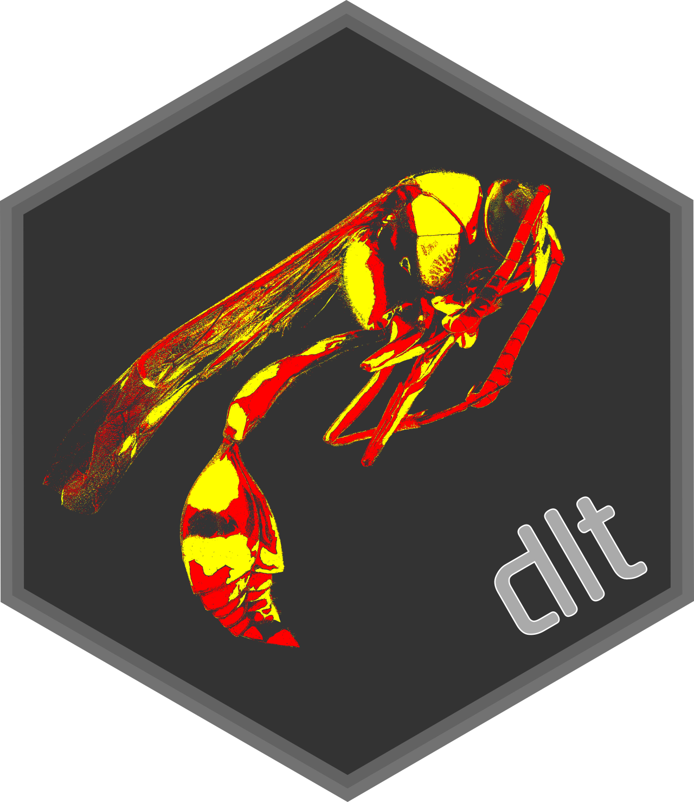

# dlt ‒ Delta Lake interface for SparkR

## Contents

- [Installation](#installation)
- [Usage](#usage)
  - [Batch reads and writes](#batch-reads-and-writes)
  - [Loading DeltaTable objects](#loading-deltatable-objects)
  - [Streaming reads and writes](#streaming-reads-and-writes)
  - [Updates](#updates)
  - [Deletes](#deletes)
  - [Merging SparkDataFrame with DeltaTable](#merging-sparkdataframe-with-deltatable)
  - [Time travel](#time-travel)
  - [Querying Delta log](#querying-delta-log)
  - [Building DeltaTables](#building-deltatables)
  - [Maintenance and conversions](#maintenance-and-conversions)
- [Notes](#notes)
- [Acknowledgments](#acknowledgments)
- [Disclaimer](#disclaimer)


## Installation

This package can be installed from the main git repository

```r
remotes::install_gitlab("zero323/dlt")
```

or its GitHub mirror

```r
remotes::install_github("zero323/dlt")
```

and requires following R packages:

- `SparkR (>= 3.1.0)`
- `magrittr`


Additionally, you'll have to ensure that a compatible Delta Lake jar is available,
for example by adding `delta-core` to `spark.jars.packages`:

```
spark.jars.packages 		io.delta:delta-core_2.12:1.0.0
```

## Usage

This package provides:

- Readers and writers for Delta format.
- DeltaTable merge API.
- Delta table builder API. 

### Batch reads and writes

`dlt_read` and `dlt_write` can be used to read and write data in Delta format.

```r
library(dlt)

target %>% 
  printSchema()

# root
#  |-- id: integer (nullable = true)
#  |-- key: string (nullable = true)
#  |-- val: integer (nullable = true)
#  |-- ind: integer (nullable = true)
#  |-- category: string (nullable = true)
#  |-- lat: double (nullable = true)
#  |-- long: double (nullable = true)

target %>% 
  dlt_write("/tmp/target")

dlt_read("/tmp/target") %>% 
  showDF(5)

# +---+---+---+---+--------+-------------------+-------------------+
# | id|key|val|ind|category|                lat|               long|
# +---+---+---+---+--------+-------------------+-------------------+
# |  1|  a|  4| -1|     KBQ| -56.28354165237397|-108.74080670066178|
# |  2|  a| 10|  1|     ROB| 50.546925463713706|-104.60825988091528|
# |  3|  a|  7| -1|     SLX|-13.985343240201473|-114.89280310459435|
# |  4|  a|  5|  1|     ACP| -47.15050248429179|-168.96175763569772|
# |  5|  b|  3| -1|     EEK|-49.020595396868885|-105.57821027934551|
# +---+---+---+---+--------+-------------------+-------------------+
# only showing top 5 rows
```

These also come with aliases following SparkR conventions - `read.delta` and `write.delta`.

```r
source %>%
  printSchema()

# root
#  |-- id: integer (nullable = true)
#  |-- key: string (nullable = true)
#  |-- val: integer (nullable = true)
#  |-- ind: integer (nullable = true)
#  |-- category: string (nullable = true)
#  |-- lat: double (nullable = true)
#  |-- long: double (nullable = true)

source %>%
  write.delta("/tmp/source")

read.delta("/tmp/source") %>% 
  showDF(5)

# +---+---+---+---+--------+------------------+-------------------+
# | id|key|val|ind|category|               lat|               long|
# +---+---+---+---+--------+------------------+-------------------+
# |  1|  a|  1|  1|     NTD| 72.72564971353859|  5.116242365911603|
# |  3|  b|  5|  1|     RSL|-65.03216980956495| -39.52675184234977|
# |  5|  b|  1| -1|     SYG| 88.00051120575517| 146.06572712771595|
# | 14|  c|  9| -1|     MYZ| 80.40028186049312|-19.090933883562684|
# | 16|  d| 10| -1|     DMO|-75.16123954206705| 120.96153359860182|
# +---+---+---+---+--------+------------------+-------------------+
```

### Loading DeltaTable objects

`DataTable` objects can be created for file system path:


```r
dlt_for_path("/tmp/target/") %>%
  dlt_to_df()

# SparkDataFrame[id:int, key:string, val:int, ind:int, category:string, lat:double, long:double]
```

or for the table name:

```r
source %>% 
  saveAsTable("source", source="delta")

dlt_for_name("source")  %>%
  dlt_to_df()

# SparkDataFrame[id:int, key:string, val:int, ind:int, category:string, lat:double, long:double]
```

### Streaming reads and writes

`dlt_read_stream` and `dlt_read_stream` can be used for streaming reads and writes respectively.

```r
query <- dlt_read_stream("/tmp/target") %>%
  dlt_write_stream(
    path = "/tmp/target-stream", queryName = "test", trigger.once = TRUE,
    checkpointLocation = "/tmp/target-stream/_checkpoints/test"
  )

awaitTermination(query, 10000)
# [1] TRUE
```


### Updates

Updates without

```r
dlt_for_path("/tmp/target") %>%
  dlt_update(list(ind = "-ind")) %>%
  dlt_show(5)

# +---+---+---+---+--------+-------------------+-------------------+
# | id|key|val|ind|category|                lat|               long|
# +---+---+---+---+--------+-------------------+-------------------+
# |  1|  a|  4|  1|     KBQ| -56.28354165237397|-108.74080670066178|
# |  2|  a| 10| -1|     ROB| 50.546925463713706|-104.60825988091528|
# |  3|  a|  7|  1|     SLX|-13.985343240201473|-114.89280310459435|
# |  4|  a|  5| -1|     ACP| -47.15050248429179|-168.96175763569772|
# |  5|  b|  3|  1|     EEK|-49.020595396868885|-105.57821027934551|
# +---+---+---+---+--------+-------------------+-------------------+
# only showing top 5 rows
```

and with

```r
dlt_for_path("/tmp/target") %>%
  dlt_update(list(
    lat = lit(39.08067389467202),
    long = lit(-89.73335678516888)
  ), column("id") %in% c(2, 4)) %>%
  dlt_show(5)

# +---+---+---+---+--------+-------------------+-------------------+
# | id|key|val|ind|category|                lat|               long|
# +---+---+---+---+--------+-------------------+-------------------+
# |  1|  a|  4|  1|     KBQ| -56.28354165237397|-108.74080670066178|
# |  2|  a| 10| -1|     ROB|  39.08067389467202| -89.73335678516888|
# |  3|  a|  7|  1|     SLX|-13.985343240201473|-114.89280310459435|
# |  4|  a|  5| -1|     ACP|  39.08067389467202| -89.73335678516888|
# |  5|  b|  3|  1|     EEK|-49.020595396868885|-105.57821027934551|
# +---+---+---+---+--------+-------------------+-------------------+
# only showing top 5 rows
```

condition are supported.

### Deletes

Deletes with

```r
dlt_for_path("/tmp/target") %>%
  dlt_delete(column("category") %in% c("ROB", "ACP")) %>%
  dlt_show(5)

# +---+---+---+---+--------+-------------------+-------------------+
# | id|key|val|ind|category|                lat|               long|
# +---+---+---+---+--------+-------------------+-------------------+
# |  1|  a|  4|  1|     KBQ| -56.28354165237397|-108.74080670066178|
# |  3|  a|  7|  1|     SLX|-13.985343240201473|-114.89280310459435|
# |  5|  b|  3|  1|     EEK|-49.020595396868885|-105.57821027934551|
# |  6|  b|  2| -1|     SMT|  80.79935231711715| -46.80488987825811|
# |  7|  b|  9|  1|     LBC|  51.65884342510253|  97.16074059717357|
# +---+---+---+---+--------+-------------------+-------------------+
# only showing top 5 rows
```

and without

```r
dlt_for_path("/tmp/target") %>%
  dlt_delete() %>%
  dlt_to_df() %>%
  count()

# [1] 0
```

condition are supported.

### Merging SparkDataFrame with DeltaTable

`dlt` supports a complete set of `DeltaMergeBuilder` methods (`dlt_when_matched_delete`, `dlt_when_matched_update`, `dlt_when_matched_update_all`, `dlt_when_not_matched_insert`, `dlt_when_not_matched_insert_all`).

```r
target %>%
  dlt_write("/tmp/target", mode="overwrite")

dlt_for_path("/tmp/target") %>%
  dlt_alias("target") %>%
  dlt_merge(alias(source, "source"), expr("source.id = target.id")) %>%
  dlt_when_matched_update_all() %>%
  dlt_when_not_matched_insert_all() %>%
  dlt_execute() %>%
  dlt_to_df() %>%
  arrange(desc(column("id"))) %>%
  showDF(10)

# +---+---+---+---+--------+------------------+-------------------+
# | id|key|val|ind|category|               lat|               long|
# +---+---+---+---+--------+------------------+-------------------+
# | 16|  d| 10| -1|     DMO|-75.16123954206705| 120.96153359860182|
# | 14|  c|  9| -1|     MYZ| 80.40028186049312|-19.090933883562684|
# | 12|  c| 10|  1|     TBL| 6.229456798173487|  55.28501939959824|
# | 11|  c|  5| -1|     ZSH| 89.73377700895071|  61.67111137881875|
# | 10|  c|  1|  1|     GKP| 58.43853528611362| 100.64806896261871|
# |  9|  c| 10| -1|     LCN| 76.90145746339113| -138.4841349441558|
# |  8|  b|  8|  1|     BOB| 47.12074530310929| -91.43876885063946|
# |  7|  b|  9| -1|     LBC| 51.65884342510253|  97.16074059717357|
# |  6|  b|  2|  1|     SMT| 80.79935231711715| -46.80488987825811|
# |  5|  b|  1| -1|     SYG| 88.00051120575517| 146.06572712771595|
#+---+---+---+---+--------+------------------+-------------------+
# only showing top 10 rows
```

### Time travel

Time travel is possible by setting `timestampAsOf` or `versionAsOf` `options`.

```r
dlt_read("/tmp/target-stream/") %>%
  count()

# [1] 12

dlt_for_path("/tmp/target-stream/") %>%
  dlt_delete("id IN (1, 3, 5)")

dlt_read("/tmp/target-stream/") %>%
  count()

# [1] 9

dlt_read("/tmp/target-stream/", versionAsOf=0) %>%
  count()

# [1] 12
```

### Querying Delta log

```r

target_stream_history <- dlt_for_path("/tmp/target-stream/") %>%
  dlt_history()

target_stream_history %>%
  printSchema()

# root
#  |-- version: long (nullable = true)
#  |-- timestamp: timestamp (nullable = true)
#  |-- userId: string (nullable = true)
#  |-- userName: string (nullable = true)
#  |-- operation: string (nullable = true)
#  |-- operationParameters: map (nullable = true)
#  |    |-- key: string
#  |    |-- value: string (valueContainsNull = true)
#  |-- job: struct (nullable = true)
#  |    |-- jobId: string (nullable = true)
#  |    |-- jobName: string (nullable = true)
#  |    |-- runId: string (nullable = true)
#  |    |-- jobOwnerId: string (nullable = true)
#  |    |-- triggerType: string (nullable = true)
#  |-- notebook: struct (nullable = true)
#  |    |-- notebookId: string (nullable = true)
#  |-- clusterId: string (nullable = true)
#  |-- readVersion: long (nullable = true)
#  |-- isolationLevel: string (nullable = true)
#  |-- isBlindAppend: boolean (nullable = true)
#  |-- operationMetrics: map (nullable = true)
#  |    |-- key: string
#  |    |-- value: string (valueContainsNull = true)
#  |-- userMetadata: string (nullable = true)

target_stream_history %>%
  select("version", "operation", "operationParameters") %>%
  showDF(truncate = FALSE)

# +-------+----------------+-------------------------------------------------------------------------------------+
# |version|operation       |operationParameters                                                                  |
# +-------+----------------+-------------------------------------------------------------------------------------+
# |1      |DELETE          |{predicate -> ["(`id` IN (1, 3, 5))"]}                                               |
# |0      |STREAMING UPDATE|{outputMode -> Append, queryId -> 8fce2444-5acf-4f82-adf9-838e64d5d82a, epochId -> 0}|
# +-------+----------------+-------------------------------------------------------------------------------------+
```

### Building DeltaTables

New tables can be created (`dlt_create`), created if not exists (`dlt_create_if_not_exists`), replaced (`dlt_replace`) and created or replaced (`dlt_create_or_replace`). All `DeltaTableBuilder` methods are supported.

```r
dlt_create() %>%
  dlt_location("/tmp/key-val") %>%
  dlt_add_column("id", "integer", nullable = FALSE) %>%
  dlt_add_columns(structType("key string, value double")) %>%
  dlt_partitioned_by("key") %>%
  dlt_comment("Key-value table") %>%
  dlt_property("creation-time", as.character(Sys.time())) %>%
  dlt_execute() %>%
  dlt_to_df() %>%
  printSchema()

# root
#  |-- id: integer (nullable = false)
#  |-- key: string (nullable = true)
#  |-- value: double (nullable = true)
```

### Maintenance and conversions

You can use `dlt` to convert Parquet directories to `DeltaTable` 

```r
target %>%
  write.parquet("/tmp/target-parquet")

dlt_is_delta_table("/tmp/target-parquet/")
# [1] FALSE

tbl <- dlt_convert_to_delta("parquet.`/tmp/target-parquet/`")

dlt_is_delta_table("/tmp/target-parquet/")
# [1] TRUE

tbl %>%
  dlt_show(5)

# +---+---+---+---+--------+-------------------+-------------------+
# | id|key|val|ind|category|                lat|               long|
# +---+---+---+---+--------+-------------------+-------------------+
# |  1|  a|  4| -1|     KBQ| -56.28354165237397|-108.74080670066178|
# |  2|  a| 10|  1|     ROB| 50.546925463713706|-104.60825988091528|
# |  3|  a|  7| -1|     SLX|-13.985343240201473|-114.89280310459435|
# |  4|  a|  5|  1|     ACP| -47.15050248429179|-168.96175763569772|
# |  5|  b|  3| -1|     EEK|-49.020595396868885|-105.57821027934551|
# +---+---+---+---+--------+-------------------+-------------------+
# only showing top 5 rows
```

vacuum `DeltaTables`:

```r
dlt_for_path("/tmp/target") %>%
  dlt_vacuum()

# Deleted 0 files and directories in a total of 1 directories.
```

generate manifests:

```r
dlt_for_path("/tmp/target") %>%
  dlt_generate_manifest("symlink_format_manifest")
```

and upgrade Delta protocols

```r
key_val_log_path <- "/tmp/key-val/_delta_log/*json"

read.json(key_val_log_path) %>%
  select("metaData.id", "commitInfo.operation", "protocol") %>%
  showDF()

# +--------------------+------------+--------+
# |                  id|   operation|protocol|
# +--------------------+------------+--------+
# |                null|CREATE TABLE|    null|
# |                null|        null|  {1, 2}|
# |72d4784b-e656-44a...|        null|    null|
# +--------------------+------------+--------+

dlt_for_path("/tmp/key-val") %>% 
  dlt_upgrade_table_protocol(1, 3)

read.json(key_val_log_path) %>%
  select("metaData.id", "commitInfo.operation", "protocol") %>%
  showDF()

# +--------------------+----------------+--------+
# |                  id|       operation|protocol|
# +--------------------+----------------+--------+
# |                null|    CREATE TABLE|    null|
# |                null|            null|  {1, 2}|
# |72d4784b-e656-44a...|            null|    null|
# |                null|UPGRADE PROTOCOL|    null|
# |                null|            null|  {1, 3}|
# +--------------------+----------------+--------+
```

## Notes

Examples use `source` and `target` datasets as described in `tests/testthat/data/README.md`.

## Acknowledgments 

Logo based on [Yellow wasp, m, left, Kruger National Park, South Africa](https://flickr.com/photos/54563451@N08/45531028154) 
by [USGS Bee Inventory and Monitoring Lab](https://www.flickr.com/photos/usgsbiml/).

## Disclaimer

Delta is a trademark of the LF Projects LLC. This project is not owned, endorsed or sponsored by the LF Projects LLC.
